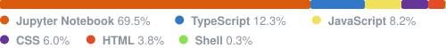

<h1> 👋 Hello, I'm Antoni Galí Gimeno </h1>
</img>
<h4 style='align:left'> 👀 I'm interested in AI Integrated & Problem Solving Software </h4>

<h4>🌱 Stack: NextJS, Typescript, TailwindCSS, React, PostgreSQL, NestJS, Neo4J...</h4>
<h4>💞️ I'm looking to collaborate on ethical and inspiring projects</h4>
<h4>📫 If you want to contact me you can write on linked

 </h4>

 

---

## 📊 GitHub Stats

<!-- GITHUB-STATS:START -->

<table width="100%">
<tr>
<td valign="top" width="48%">

### ⚡ Quick Stats

| | |
|---|:---:|
| 📦 Public repos | **13** |
| 🔀 PRs opened | **107** |
| ✅ PRs merged | **104** |
| 💻 Commits (yr)* | **4372** |
| 🐛 Issues opened | **3** |
| 👥 Followers | **8** |

* public + private this year

</td>
<td valign="top" width="52%">

### 🗣️ Top Languages

</td>
</tr>
</table>

📅 Last updated: Aug 7, 2026

<!-- GITHUB-STATS:END -->
